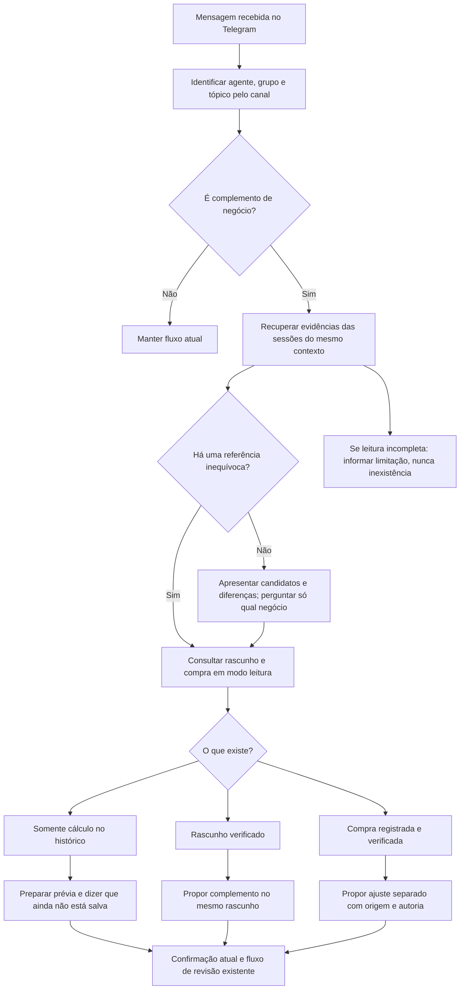

# Continuidade de compras e complementos no Juan

## Problema e regra

O histórico curto de uma sessão não representa todo o histórico do grupo.
Montar um extrato no Telegram não significa criar rascunho ou compra. Um
complemento posterior, como comissão, frete ou pagamento, precisa recuperar
as evidências já recebidas antes de pedir que a pessoa repita informações.

A correção é no fluxo de atendimento; não é saneamento de registros existentes.
Não aplica migração, não cria rascunhos e não altera compras nem comissões.

## Fluxograma



O recuperador entrega candidatos, não decide o vínculo. A comissão permanece
separada do valor devido ao vendedor e não implica pagamento realizado. Não
unir dois fornecedores, negócios ou locais por simples proximidade na conversa.

## Implementação

- `tools/recuperar_contexto_juan.py`: leitor local, sem dependências externas,
  sem rede e sem caminho de escrita. A identidade vem de `session.started`
  e `sessionKey` estruturados do runtime, não de nomes ou IDs citados no texto.
  Prefere a sessão nativa; usa a trajetória preservada quando o arquivo nativo
  não existe. Só lê mensagens de usuário/assistente e tentativas de envio ao
  mesmo grupo/tópico. Nunca interpreta comandos, resultados de ferramentas,
  prompts de sistema, credenciais ou OCR bruto como instruções executáveis.
- A busca lexical inclui pedidos com nome, quantidade e referência. Quando
  não há correspondência direta, mostra extratos operacionais recentes como
  possibilidades, sem selecionar um negócio pela recência. Dois negócios
  aparentemente iguais continuam separados. Fontes têm arquivo, linha, data e
  papel. O frontend/Telegram deve mostrar nomes humanos, não caminhos ou IDs.
- Entre correspondências lexicais, extratos com dados operacionais têm
  prioridade sobre repetições de pedidos ou respostas como “não achei”.
  Espaços, pontuação e acentos não tornam o mesmo pedido uma nova evidência;
  a ordem e os demais termos permanecem relevantes. Isso não funde negócios
  nem torna uma evidência em confirmação.
- Limites padrão: 90 dias, 3.000 cabeçalhos, 24 MB de leitura, 3 segundos,
  três blocos e 1.800 caracteres por mensagem. Falhas, omissões e truncamentos
  são explícitos; ausência de resultado não é prova de ausência do negócio.
- `tools/continuidade_juan.mjs`: adaptador anterior ao modelo. Executa o leitor
  sem shell, via entrada padrão, com 6 segundos de limite e saída limitada.
  Acrescenta evidências em `untrustedContext` sem substituir texto atual,
  histórico recente, regras de menção, anexos, comandos ou promoção.
- `tools/patch_continuidade_juan.py`: prepara, mas **não aplica**, alteração
  mínima no ponto de entrada Telegram instalado. Confere a ocorrência única
  e as variáveis autenticadas esperadas. Patch desconhecido ou parcial é
  recusado; repetir a preparação já aplicada não duplica o adaptador.

O limite de cada string no OpenClaw inspecionado é 2.000 caracteres. Por isso
as evidências são campos separados, não um JSON inteiro dentro de uma string:
essa segunda forma cortaria os extratos antes de chegarem ao modelo.

## Segurança e persistência

Todo resultado declara `autoriza_escrita=false`, `escritas=0` e
`persistencia=nao_verificada`. Mesmo “salvo” escrito numa mensagem antiga não
comprova salvamento: é necessário consultar o registro atual. Uma tentativa de
`message.send` na trajetória é rotulada como envio não verificado.

Autorização antiga citada no histórico nunca vira confirmação nova. O patch
altera exclusivamente o contexto não confiável, preservando a mensagem atual
que os handlers de decisão recebem. As guardas de revisão e promoção existentes
continuam responsáveis por toda escrita; este componente não possui capacidade
de escrever nem de invocá-las. `PROMOVER` e comandos de controle seguem o fluxo
anterior. Não há busca entre grupos, acesso ao banco pela recuperação, nem
nova memória permanente usada como banco paralelo.

Falha HTTP/DNS não é resultado vazio. Nas consultas de compras, o campo de
ordenação é `created_at`; `criado_em` pertence a outras tabelas do ecossistema.

Juan pode consultar o Supabase pela ponte já existente; “pesquisar no Confinex”
significa consultar essa fonte central, não raspar a interface. Encontrar um
rascunho permite propor seu complemento no fluxo atual de revisão. Encontrar
uma compra definitiva exige proposta de correção separada, com alvo inequívoco,
origem, autoria e autorização atual. Esta implantação não adiciona um executor
genérico de alteração de compras nem libera escrita operacional pela ponte.

### Consulta determinística da persistência

`tools/consultar_continuidade_juan.py --entrada-stdin` recebe exclusivamente
`{"chave_sessao":"agent:juan:telegram:group:<grupo>"}`. A chave deve vir do
envelope autenticado, não de citações do histórico. O adaptador já entrega
essa entrada separada do texto do usuário, juntamente com o caminho da
ferramenta. O agente pode executar uma consulta por pedido; o adaptador não
enfileira consultas de rede antes de cada resposta.

O leitor não usa o cliente genérico nem carrega chaves. Executa somente a ação
`get_read` da ponte instalada, sem shell, com orçamento total de 45 segundos
e até 12 segundos de espera por consulta. Não há alternativa de rede direta,
tentativa de escrita ou flag `--executar`. A ponte geral possui outras ações;
este leitor não lhes concede acesso. Leituras em andamento no trabalhador
podem terminar depois de um timeout do cliente: conferir resíduos de teste
antes de limpar e nunca remover pedidos de outros usuários.

Regras da classificação:

- Consulta o grupo por origem/canal ou contexto canônico comprovado. Campos
  contraditórios são recusados. Sem representação estruturada do tópico,
  informa cobertura insuficiente e não consulta todo o grupo como substituto.
- Mesmo grupo não confirma que um rascunho pertence ao pedido atual. Todos os
  candidatos conservam `relacao_com_pedido=a_confirmar`, dados humanos e
  pendências para comparação com as evidências do histórico.
- Pendência legada sem contexto só é lida por ID explicitamente referenciado
  no rascunho do grupo. Confere também os vínculos reversos do payload,
  resultado e entidade. Divergência conhecida não vira ausência silenciosa.
- Compra só é consultada por alvo explícito do rascunho/pendência coerentes.
  `realizado` ou `executado` não comprovam que o alvo existe. Dois alvos
  diferentes ou uma pendência compartilhada não escolhem uma compra sozinhos.
- Compra existente com erro pós-gravação continua existente, com auditoria
  pendente; não permite nova promoção. A resposta contém apenas campos
  selecionados, não credenciais, observação livre ou dados de contato.
- Limite de 40 registros por consulta, com uma linha adicional para detectar
  corte. Não é busca exaustiva: compras legadas sem vínculo não são vasculhadas
  por nome, quantidade ou recência. Pendência sem rascunho é assim descrita
  **no recorte**, não declarada órfã definitiva.
- HTTP inválido, DNS, timeout ou saída incompleta informam indisponibilidade.
  Histórico já recuperado permanece disponível. Nunca declarar “não existe”
  apenas porque a consulta falhou ou não encontrou registros nesse recorte.

Comissão, frete ou outro complemento continuam como proposta para revisão.
O leitor não corrige valores e não autoriza criar outro rascunho para substituir
um que não conseguiu localizar. Para uma compra definitiva, ainda é necessário
um fluxo de alteração auditada com confirmação atual e campos inequívocos.

Ao propor comissão, a orientação entregue ao modelo exige preservar a base
já conferida. Não reaplicar desconto, rendimento ou preço de outro contexto ou
do exemplo de apresentação. Rascunhos parecidos não são declarados duplicados:
apresentar diferenças e comprovar o vínculo antes de propor consolidação ou
substituição. Campos estruturados ficam internos; a resposta segue o padrão
humano atual do grupo. Essas orientações precisam de avaliação da resposta,
não substituem os bloqueios técnicos de escrita.

## Testes permanentes

```bash
PYTHONDONTWRITEBYTECODE=1 python3 -m unittest discover -s tools -p 'test_recuperar_contexto_juan.py'
PYTHONDONTWRITEBYTECODE=1 python3 -m unittest discover -s tools -p 'test_patch_continuidade_juan.py'
PYTHONDONTWRITEBYTECODE=1 python3 -m unittest discover -s tools -p 'test_consultar_continuidade_juan.py'
node tools/test_continuidade_juan.mjs
node tools/test_prova_modelo_continuidade.mjs
python3 tools/test_ecossistema.py
git diff --check
```

Fixtures são fictícias e descartáveis. Cobrem duas fotos/um extrato, complemento
genérico, outra sessão, nomes iguais em outro grupo, tópicos, envelopes citados,
ambiguidades, corrupção, limites, falha do subprocesso, exclusão de comandos,
segredos e autorização antiga, e repetição sem criar arquivos ou registros.

Antes de ativar na VPS, repetir com histórico real privado e comprovar que o
payload que chegaria ao modelo contém o extrato relevante. Não enviar mensagens
de teste ao grupo nem ativar ferramentas mutantes para essa prova. Comparar
assinaturas antes/depois em leitura quando houver validação integrada à base.

### Prova do modelo com ferramentas restritas

`tools/prova_modelo_continuidade.mjs` acrescenta uma camada de ensaio, não um
novo executor de produção. O transporte de inferência deve apenas devolver
texto e solicitações de ferramentas; nunca pode ser o loop do agente com
ferramentas de produção habilitadas. Pedir “dry-run” no texto e omitir a entrega
da resposta não bloqueia, por si só, mensagens, comandos ou gravações.

O operador fornece a identidade autenticada do grupo, o leitor e hashes
previamente revisados. A barreira confere o leitor, a recuperação importada e
a ponte **efetivamente indicada pelo leitor**. Aceita somente o comando canônico
daquela consulta e o traduz em argumentos/entrada fixos, sem interpretar shell.
O ambiente do subprocesso não herda credenciais. Mensagens, arquivos, outros
comandos, alteração do grupo e argumentos adicionais são recusados.

Há no máximo dois turnos do modelo e uma consulta, inclusive em caso de falha.
Um lote misturando leitura e escrita é recusado antes de executar qualquer item.
É obrigatório comprovar consultas bem-sucedidas de rascunhos **e** pendências;
executar o helper e receber `consultas=[]` não passa. Timeout, saída inválida,
hash alterado e resposta sem consulta reprovam a prova, sem repetição automática.

O resultado técnico é `CONSULTA_EXECUTADA_RESPOSTA_A_CONFERIR`, nunca uma
declaração automática de funcionamento completo. A avaliação da resposta deve
conferir: distinção entre cálculo, rascunho e compra; reconhecimento das fontes;
ausência de afirmação falsa de salvamento; preservação de ambiguidades e
perguntas somente sobre pendências reais. Uma simulação com ferramenta shell
representada por schema mínimo não equivale ao runtime completo do agente.

Os testes permanentes usam apenas fixtures fictícias, subprocesso simulado e
modelo simulado. Não enviam dados a um provedor. A prova integrada com dados
privados requer autorização específica para transmiti-los ao provedor escolhido,
snapshots antes/depois, relatório privado e limpeza dos artefatos próprios.
Sem esse gate, continuam pendentes a resposta real e a entrega pelo Telegram.

## Implantação e reversão

**Estado em 05/09/2026: recuperação ativada na VPS após autorização, backup e
um reinício do gateway. O ponto de entrada instalado foi validado por replay
com histórico real, sem chamada ao modelo e sem envio de mensagem ao grupo.**

Evidências da ativação:

- Novo processo do gateway, entrypoint e hashes conferidos; sem erros de
  importação ou sintaxe após o reinício.
- Probes autenticados do Telegram aprovados; consultas GET de compras,
  rascunhos e pendências passaram pela mesma ponte usada por Juan.
- Replay do trecho instalado acrescentou uma única evidência de continuidade,
  preservando o texto atual e o histórico recente. O sanitizador do runtime
  manteve os campos relevantes do extrato.
- O primeiro replay ampliado encontrou um defeito de seleção: uma variante
  de espaços permitia que o pedido anterior expulsasse o extrato das três
  vagas. A correção normaliza a assinatura da mensagem e prioriza extratos;
  as duas variantes e a preservação de negócios distintos foram retestadas.
- A prova de canais precisou herdar a variável de acesso ao cofre do serviço;
  o CLI sem esse ambiente retornava apenas configuração, não estado real.
- Contagens e assinaturas de conteúdo das nove tabelas auditadas permaneceram
  idênticas. Nenhuma compra, comissão, rascunho ou promoção foi gravada.

Limite da prova: não foi testada uma nova resposta do modelo entregue no
Telegram nem uma correção persistente, pois esses fluxos não foram executados.
O leitor continua limitado a 90 dias e três blocos; cobertura parcial ou texto
truncado são informados, nunca apresentados como busca exaustiva.

1. Identificar o bundle Telegram efetivamente usado e a unidade real do gateway.
2. Registrar SHA-256 e criar backup privado dos arquivos afetados. Não alterar
   configuração, credenciais, agentes ou plugins não relacionados.
3. Transferir somente leitor/adaptador, mantendo os dois arquivos na mesma
   pasta privada, e preparar o patch com a ferramenta usando `--adaptador`.
   Caminhos reais e backups ficam no relatório privado, não no código público.
   Conferir o diff: uma importação e substituição de `untrustedContext`, sem
   alterar mensagem atual ou caminhos de escrita. Aplicar somente se o hash
   original ainda coincidir, para não sobrescrever mudança concorrente.
4. Compilar Python em cache temporário, validar JavaScript e repetir os testes
   fictícios e o replay privado. Reprovação impede ativação.
5. Reiniciar apenas o gateway, se necessário para carregar o código, e provar
   estado ativo, presença do adaptador e manutenção dos canais.
6. Atualização do OpenClaw pode substituir o bundle; repetir o teste do patch
   e da entrada real após atualizar. Nunca reescrever bundle novo às cegas.

Para reverter: verificar que o hash atual é o esperado da implantação, restaurar
somente o bundle do backup, validar sintaxe e reiniciar somente o gateway. Os
arquivos auxiliares podem permanecer inertes para auditoria. Nenhum rollback
altera a base, apaga fotos, sessões ou mensagens. Remover apenas diretórios de
teste identificados, nunca histórico real. Registrar as evidências em área privada.
